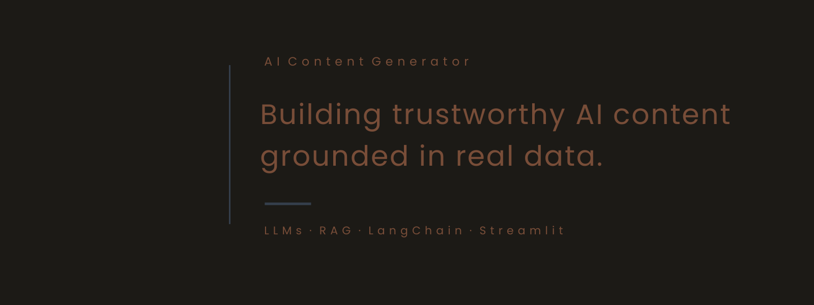

🇬🇧 [English](README.md) · 🇪🇸 [Español](README.es.md)

  <a href="https://tu-demo.streamlit.app">🌐 Demo en vivo</a> ·
  <a href="https://github.com/MaryoriCruz/ai-content-generator">📂 Repositorio</a>

<i>De un solo tema a contenido listo para publicar en cuatro plataformas, con datos reales de respaldo.</i>

---

## El Problema

Crear contenido para múltiples plataformas — blog, Twitter/X, Instagram, LinkedIn — es repetitivo y consume mucho tiempo, y mantener un tono consistente en todas ellas es todavía más difícil.

Además, el contenido genérico de un LLM tiende a inventar datos o sentirse desconectado de la realidad: sin datos financieros reales, sin base en investigación real.

Este proyecto explora cómo un pipeline de LLM bien estructurado — no solo un prompt suelto — puede producir contenido apropiado para cada plataforma, coherente con la marca, y respaldado en fuentes reales, detectando además contenido de baja calidad antes de que llegue al usuario.

---

## La Solución

AI Content Generator es una aplicación web que convierte un tema, audiencia objetivo y plataforma en contenido listo para publicar, con dos modos de respaldo que la diferencian de un simple prompt de "escríbeme un post":

- **Modo financiero:** obtiene datos bursátiles y noticias en tiempo real (Alpha Vantage) antes de escribir, para que el contenido financiero refleje condiciones reales del mercado en vez de cifras inventadas.
- **Modo científico RAG:** recupera papers reales de arXiv mediante un vector store en ChromaDB, para que el contenido divulgativo sobre IA/ML se base en investigación genuina, no solo en el conocimiento (a veces desactualizado) del modelo.

Cada pieza de contenido generado puede acompañarse opcionalmente de una imagen relevante (HuggingFace, con fallback inteligente a Unsplash), y cada solicitud pasa por un control de calidad automatizado antes de mostrarse al usuario.

---

## Detalles Técnicos

**Resumen del pipeline:**

1. La usuaria define tema, plataforma, audiencia y (opcionalmente) un perfil de marca.
2. Si el modo financiero o científico está activo, primero se recuperan datos reales (Alpha Vantage o arXiv + ChromaDB).
3. Una cadena de prompts específica por plataforma (LangChain) genera el contenido usando modelos LLaMA alojados en Groq.
4. Un segundo LLM actúa como juez, evaluando relevancia, coherencia y formato.
5. Si el score cae por debajo del umbral de calidad, el sistema reintenta la generación automáticamente una vez.
6. El contenido final — más una imagen opcional — se devuelve a la usuaria.

**Guardrails (LLM como juez)**

En lugar de confiar ciegamente en la primera generación, un segundo modelo evalúa el resultado según tres criterios antes de que llegue a la usuaria:

- **Relevancia** — ¿el contenido realmente aborda el tema solicitado?
- **Coherencia** — ¿el texto tiene sentido lógico?
- **Formato** — ¿respeta la estructura esperada para esa plataforma?

El contenido que puntúa por debajo del umbral mínimo (5/10) se regenera automáticamente, una vez, antes de mostrarse.

**Stack Tecnológico**

**LLMs:** Groq (LLaMA 3.1 8B / LLaMA 3.3 70B)
**Framework LLM:** LangChain
**Observabilidad:** LangSmith
**Frontend:** Streamlit
**Imágenes:** HuggingFace Inference API + Unsplash API
**Datos financieros:** Alpha Vantage API
**RAG:** arXiv API + ChromaDB + HuggingFace Embeddings
**Contenedores:** Docker + Docker Compose
**Gestión de paquetes:** uv

---

## Resultados

Probado de principio a fin en las cuatro plataformas y ambos modos de respaldo (financiero y RAG científico), con calidad de salida consistente. Una ejecución representativa, usando el modo RAG científico sobre el tema "large language models":

| Verificación | Resultado |
|---|---|
| Score de calidad | 8/10 |
| Relevante | ✅ |
| Coherente | ✅ |
| Formato | ✅ |
| Fuente | Papers reales de arXiv recuperados vía ChromaDB |

El modo financiero se probó de principio a fin con un ticker real (AAPL): el sistema obtuvo noticias y datos de precio actuales antes de generar contenido específico por plataforma, cerrando con un disclaimer financiero añadido automáticamente — un detalle pequeño que importa cuando un LLM escribe sobre mercados reales.

Todas las solicitudes están instrumentadas con trazabilidad de LangSmith (inputs, outputs, uso de tokens, latencia) para observabilidad en producción — la arquitectura soporta depuración a nivel de cada solicitud, aunque las trazas en sí no se incluyen aquí.

---

## Lo Que Este Proyecto Demuestra

- Diseño de un pipeline de LLM en varios pasos (recuperación → generación → evaluación → reintento condicional), no solo un prompt y listo
- Fundamentar el contenido generado en datos externos reales y actuales (APIs financieras, papers de arXiv), en vez de confiar solo en el conocimiento de entrenamiento del modelo
- Construcción de un control de calidad automatizado (LLM como juez) que detecta contenido deficiente antes de que la usuaria lo vea
- Ingeniería orientada a producción: despliegue containerizado, configuración basada en variables de entorno, y observabilidad vía LangSmith
- Trabajo independiente a través de todo un stack de aplicación LLM — recuperación, orquestación, evaluación y una interfaz usable

---

## Roadmap

- Resolver el conflicto actual de versión SDK de LangSmith que afecta el registro de trazas
- Añadir historial y exportación de contenido por plataforma
- Ampliar las fuentes de RAG más allá de arXiv (ej. blogs corporativos, documentación)
- Añadir seguimiento de costo/uso por generación
- Pipeline de CI/CD
- Añadir autenticación y cuentas de usuario
- Desplegar en infraestructura cloud

---

## Aviso

El contenido generado tiene fines educativos y de demostración.

Aunque el respaldo con datos reales y la evaluación automática de calidad mejoran la fiabilidad, siempre se debe verificar información crítica o sensible antes de publicarla.

---

## Autora

**Maryori Cruz** — Bootcamp de IA, Factoría F5

Desarrollado como proyecto final del módulo de LLMs: *Generador de Contenido con IA*.
